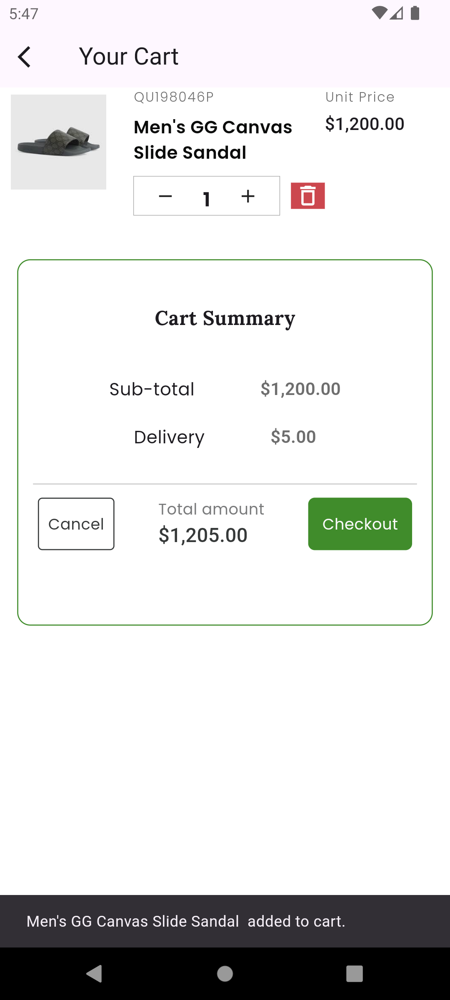
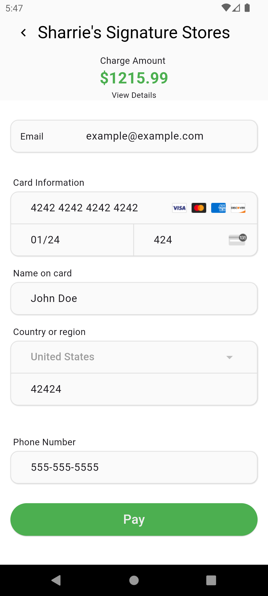
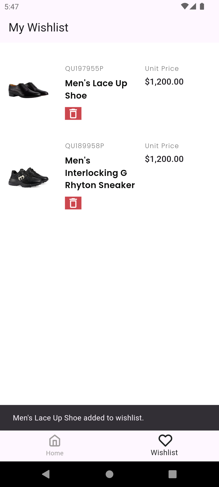

# easy_shopper_2

A Simplified shopping application that displays products fetched from the [Timbu Api](https://timbu.com/).

## Main Features
- Add to cart and remove from cart.
- Add to wishlist and remove from wishlist.
- Simulate a payment checkout flow.
- Store order history in local storage.
- View products by category.
- Search products.

Here are some screenshots of the application:








## Download
Here's the link to download the apk:
[Download here](https://github.com/Joshokelola/easy_shopper_2/releases/download/V1.1/app-release.apk)

## Test App Online
[https://appetize.io/app/b_e27yxeqbnjhyrpg6vmf4lcnvym]

## Getting Started
1. Follow the [Flutter guide](https://docs.flutter.dev/get-started/install) to
   install Flutter and the platform of you choice (iOS and/or Android).
2. Ensure Flutter is correctly configured by running `flutter doctor`

## Running the app
Run this code first
```sh
flutter pub get
```
Then...
```sh
flutter run
```
